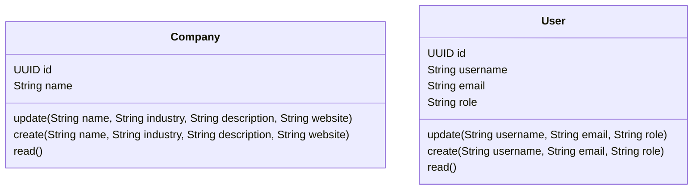

```mermaid
classDiagram
    class Company {
        UUID id
        String name
        update(String name, String industry, String description, String website)
        create(String name, String industry, String description, String website)
        read()
    }
    class User {
        UUID id
        String username
        String email
        String role
        update(String username, String email, String role)
        create(String username, String email, String role)
        read()
    }


```
