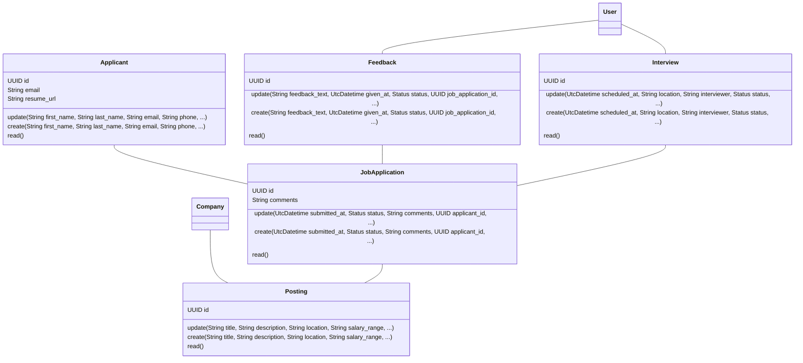

```mermaid
classDiagram
    class Applicant {
        UUID id
        String email
        String resume_url
        update(String first_name, String last_name, String email, String phone, ...)
        create(String first_name, String last_name, String email, String phone, ...)
        read()
    }
    class Posting {
        UUID id
        update(String title, String description, String location, String salary_range, ...)
        create(String title, String description, String location, String salary_range, ...)
        read()
    }
    class Feedback {
        UUID id
        update(String feedback_text, UtcDatetime given_at, Status status, UUID job_application_id, ...)
        create(String feedback_text, UtcDatetime given_at, Status status, UUID job_application_id, ...)
        read()
    }
    class Interview {
        UUID id
        update(UtcDatetime scheduled_at, String location, String interviewer, Status status, ...)
        create(UtcDatetime scheduled_at, String location, String interviewer, Status status, ...)
        read()
    }
    class JobApplication {
        UUID id
        String comments
        update(UtcDatetime submitted_at, Status status, String comments, UUID applicant_id, ...)
        create(UtcDatetime submitted_at, Status status, String comments, UUID applicant_id, ...)
        read()
    }

    Company -- Posting
    User -- Feedback
    User -- Interview
    Applicant -- JobApplication
    Feedback -- JobApplication
    Interview -- JobApplication
    JobApplication -- Posting

```
