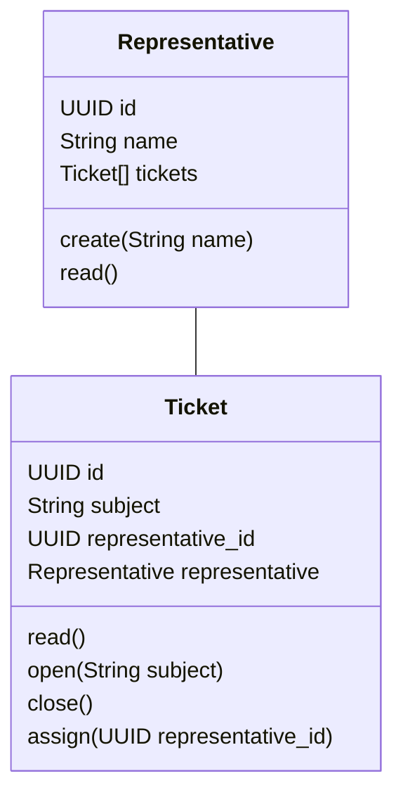

```mermaid
classDiagram
    class Ticket {
        UUID id
        String subject
        UUID representative_id
        Representative representative
        read()
        open(String subject)
        close()
        assign(UUID representative_id)
    }
    class Representative {
        UUID id
        String name
        Ticket[] tickets
        create(String name)
        read()
    }

    Representative -- Ticket

```
